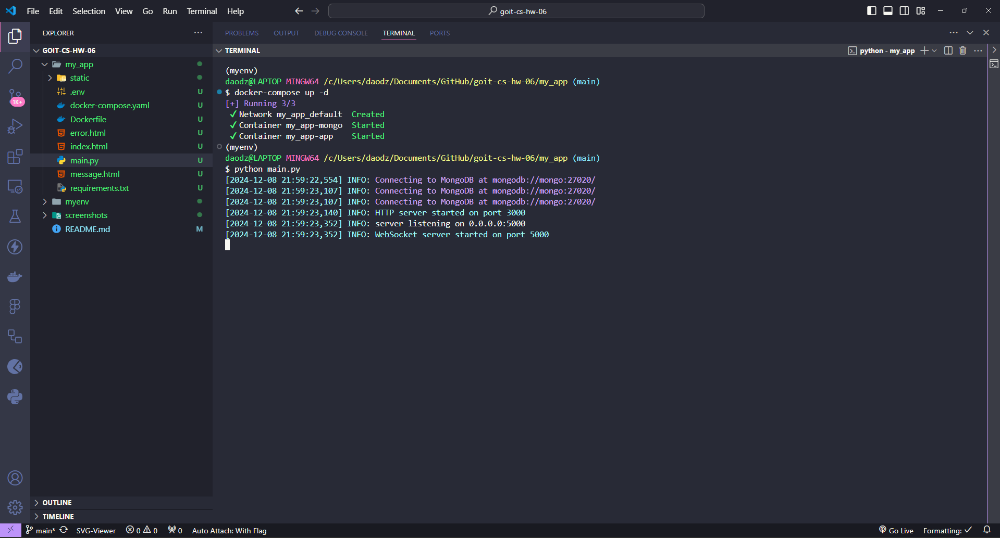
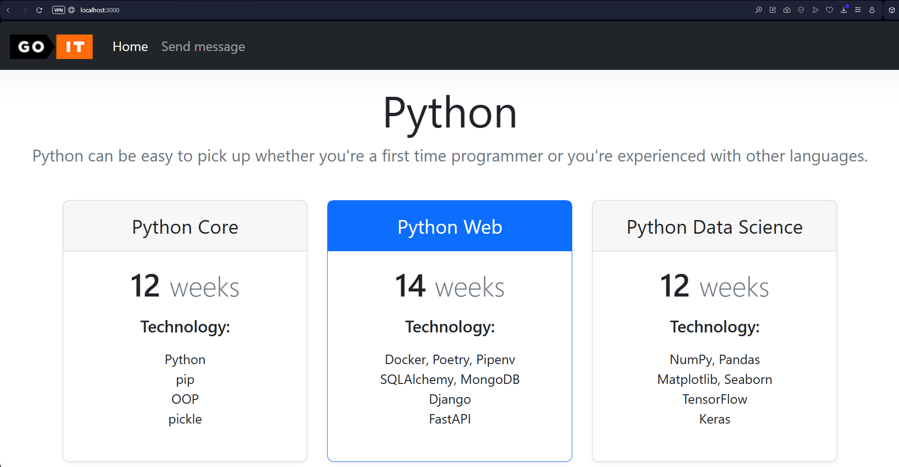
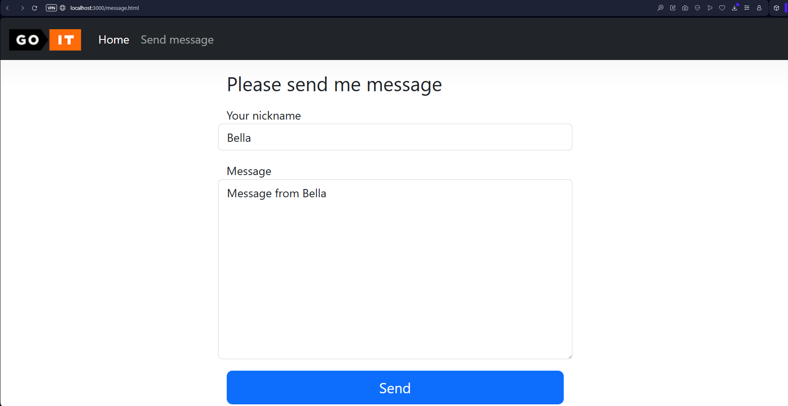
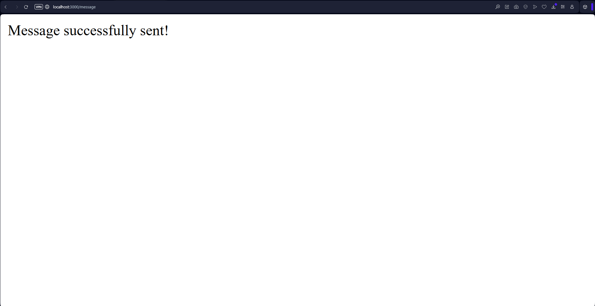
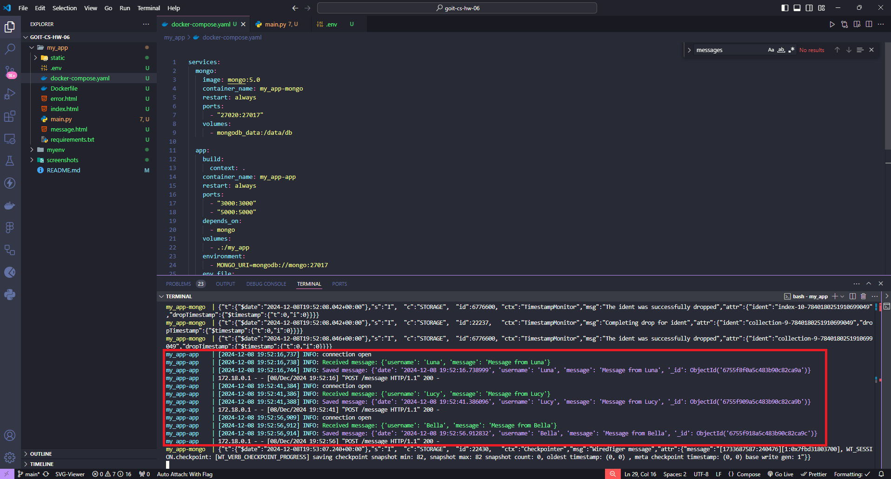
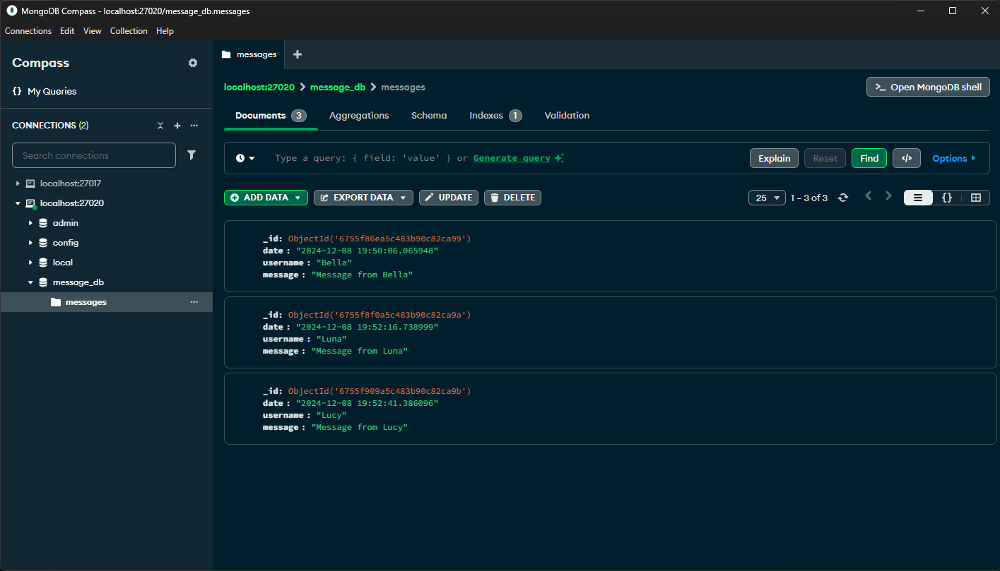
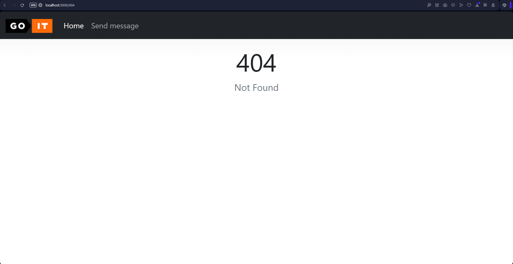

# Technical Task Description

## Instructions and Requirements

1. Following the example provided in the lecture notes, create a web application with routing for two HTML pages: `index.html` and `message.html`.

2. Additionally, implement the following:

- Handle static resources: `style.css`, `logo.png`.
- Enable form handling on the `message.html` page.
- In case of a `404 Not Found` error, return the `error.html` page.
- Your HTTP server must run on port `3000`.

3. For handling the form data, create a Socket Server on port `5000`. The workflow should be as follows:

- You input data into the form.
- The data is sent to the web application, which forwards it to the Socket Server for processing via `sockets` (choose either `UDP` or `TCP` protocol).
- The Socket Server converts the received byte string into a dictionary and saves it into a MongoDB database.
- The MongoDB document format should look like this:

5. The MongoDB document format should look like this:

```json
{
	"date": "2022-10-29 20:20:58.020261",
	"username": "krabaton",
	"message": "First message"
},
{
	"date": "2022-10-29 20:21:11.812177",
	"username": "Krabat",
	"message": "Second message"
}
```

The `"date"` field should store the time the message was received (`datetime.now()`). Each new message from the web application must be appended to the database along with the time it was received.

## Acceptance Criteria

- The web application is implemented in a single `main.py` file, with the HTTP Server and Socket Server running in separate processes.
- A Dockerfile is created, and the application runs as a Docker container.
- A docker-compose.yaml file is written with configurations for the application and MongoDB.
- Docker Compose is used to build the environment, and the application starts using the `docker-compose up` command.
- The volumes mechanism is used to ensure database data is stored outside the container.
- Static resources (`style.css`, `logo.png`) are properly handled.
- The `404 Not` Found error returns the `error.html` page.
- Form handling is implemented according to the requirements.
- The MongoDB document format matches the specified requirements.

---

# Results of work

## **1. Docker creation and connection**



## **2. Web page on localhost**



## **3. Send message page**



## **4. Result of sending message**



## **5. Docker logs about sending messages**



## **6. Message objects stored in the database**



## **7. A totally out-of-context screenshot that's, like, `super critical` for my mentor to approve my work and recognize my undeniable genius (or at least not fail me)😁.**


